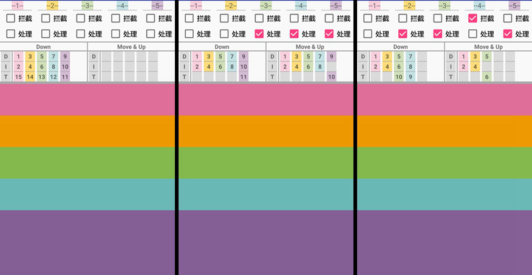
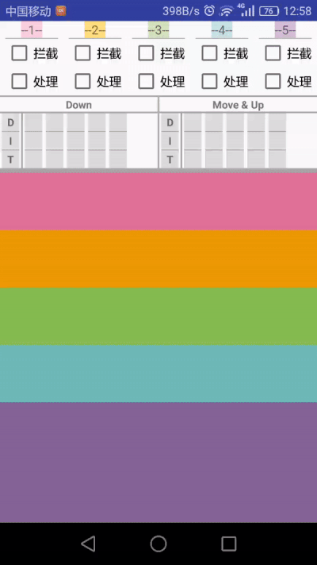
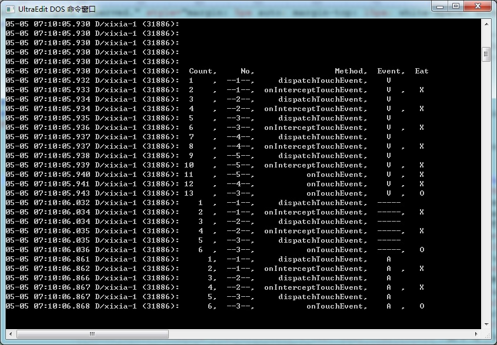

# AndroidTouchModel
This is a simple apk help you to understand how the Android TouchEvent works.

# ScreenShot:
There are 5 views in this apk. "--1--" is the root view and contains "--2--", and "--2--" contains "--3--", same as the others.
  
In the top is the control panel, you can control the views how to act in **onInterceptTouchEvent(拦截)** and **onTouchEvent(处理)**. 
With the checkbox checked, that means its will return true in these method, otherwise means false.
  
The middle area is the result panel, when you touch the bottom area, this panel will shows you how does the touch transfer(see the number
in the small square), and how does views act when hit **ACTION_DOWN** and **ACTION_MOVE** and **ACTION_UP**.

The bottom area is the touch area.

### Left picture 
  
No views to eat this touch, after **ACTION_DOWN**, **ACTION_MOVE** and **ACTION_UP** will not come, because there are no 
touch target view find.
  
### Middle picture 
  
No views to intercept(拦截) this touch, and 3 views want to eat(处理) this touch, and the "--5--" view eat this touch 
successfully, and next time during the **ACTION_MOVE** and **ACTION_UP**, "--5--" view's **onInterceptTouchEvent** will not
be called, the touch event will be transfer from "--5--" view's **dispatchTouchEvent** to **onTouchEvent(处理)** directly.
  
### Right picture 
  
One view intercept(拦截) this touch, so "--5--" can not reach this touch, and this touch was eat by the "--3--". And after 
**ACTION_DOWN**, the "--4--" view will not get touch again, because we found "--3--" is the touch target, so we just 
directly pass the touch to "--3--".

# VideoShot：

  
# Log output

You also can see the below log output to help you to study.
  
There are many duplicate outputs during the **ACTION_MOVE**, so I had just cut all the duplicate logs. If you want to open it,
you can modified LogUtils.java.

